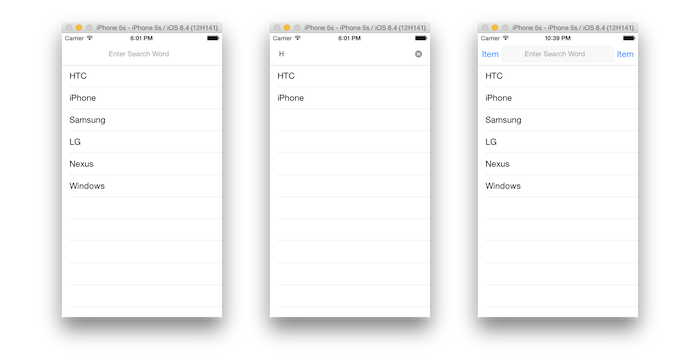

# Custom UISearchBar on the UINavigationBar

This is an example for customizing UISearchBar. No border search bar or using custom background image like below. 

# CustomSearchControllerSwift
* [https://github.com/mechaman/CustomSearchControllerSwift](https://github.com/mechaman/CustomSearchControllerSwift)

Want to place the UISearchBar somewhere other than in the header of a tableView and still have the search results show up in the tableView? Don't want that nasty cancel to pop up everytime you do a search? This simple iOS app does just that! This is done by creating a custom UISearchController and UISearchBar as well as properly establishing the delegates.

For the Objective-C: https://github.com/mechaman/CustomSearchControllerObjc

Enjoy.
